# 活性化関数

## 恒等写像関数
- 値をそのまま返す関数

#### 定義
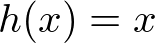

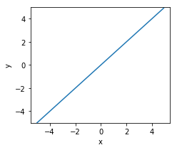

#### 実装
```py
def linear(x):
    return x
```

## ステップ関数
- 0で不連続な関数
  - ※グラフは連続で描画されている

#### 定義
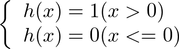

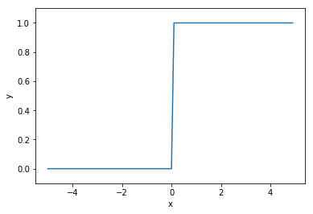

#### 実装
```py
def step(x):
    return np.array(x>0).astype(np.int)
```

## シグモイド関数
- -∞で緩やかに0に収束、+∞で緩やかに1に収束する関数

#### 定義
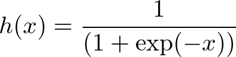

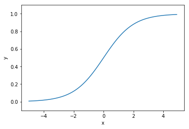

#### 実装
```py
def sigmoid(x):
    return  1 / (1 + np.exp(-x))
```

## tanh関数
- -∞で-1に収束、+∞で1に収束する関数

#### 定義
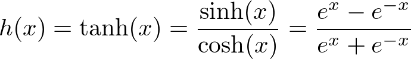


#### 実装
```py
def tanh(x):
    # np.tanh(x)
    return (np.exp(x) - np.exp(-x)) / (np.exp(x) + np.exp(-x))
```

## ReLU関数
- 負の値は0を、正の値は恒等写像関数を取る関数

#### 定義
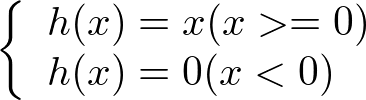

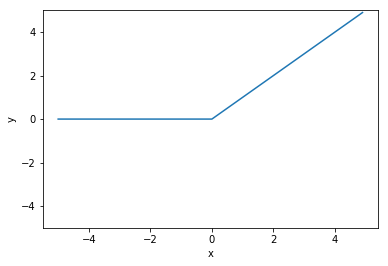

#### 実装
```py
def relu(x):
    return np.maximum(0, x)
```

## LeakyReLU関数
- 負の値でReLU関数に傾きを与えた値を取る関数

#### 定義
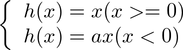


#### 実装
```py
def leakyrelu(x, a=0.1):
    return np.maximum(0, x) + np.minimum(0, x) * a
```

## Softplus関数
- -∞で0に収束、正の値で+∞を取る関数

#### 定義
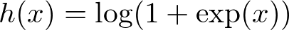

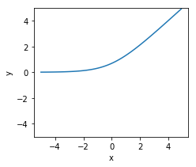

#### 実装
```py
def softplus(x):
    return np.log(1 + np.exp(x))
```

## Hartanh関数

#### 定義
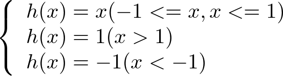

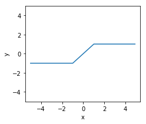

#### 実装
```py
def hardtanh(x):
    return np.maximum(-1, np.minimum(1, x))
```
