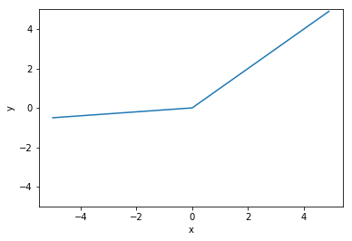

## 活性化関数
#### 恒等写像関数
値をそのまま返す関数

#### ステップ関数
0で不連続な関数
※グラフは連続で描画されている

#### シグモイド関数
-∞で緩やかに0に収束、+∞で緩やかに1に収束する関数

#### tanh関数
-∞で-1に収束、+∞で1に収束する関数

#### ReLU関数
負の値は0を、正の値は恒等写像関数を取る関数

#### LeakyReLU関数
負の値でReLU関数に傾きを与えた値を取る関数

#### Softplus関数
-∞で0に収束、正の値で+∞を取る関数

#### Hartanh関数

