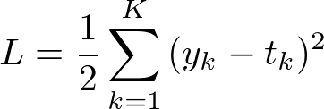
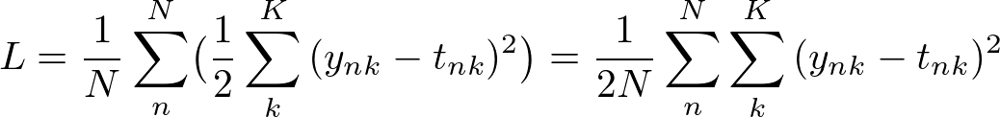
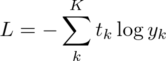
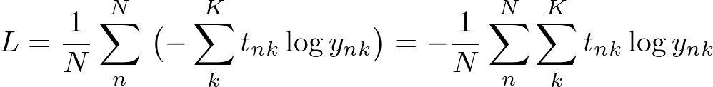

# 損失関数

### What's 損失関数
- ニューラルネットワークの質の悪さを示す指標
- 重みが教師データに適合していないことを示す指標

## 2乗和誤差
- 回帰問題で使用される損失関数

#### 定義


```
L:損失関数
K:出力層のノード数
k:出力層のノード番号
y_k:ノードkの出力値
t_k:ノードkの正解値
```

#### 実装
```py
import numpy as np

L = 0.5 * np.sum((y - t) ** 2)
```

### バッチ版

#### 定義


```
L:損失関数
N:データ数
n:データ番号
K:出力層のノード数
k:出力層のノード番号
y_{nk}:データnのノードkの出力値
t_{nk}:データnのノードkの正解値
```

#### 実装
```py
import numpy as np

# 1次元配列は2次元配列にする
if y.ndim==1:
    t = t.reshape(1, -1)
    y = y.reshape(1, -1)

batch_size = y.shape[0]
L = 0.5 * np.sum((y - t) ** 2) / batch_size
```

## クロスエントロピー誤差
- 分類問題で使用される損失関数

#### 定義


```
L:損失関数
K:出力層のノード数
k:出力層のノード番号
y_k:ノードkの出力値(0と1の間を取る)
t_k:ノードkの正解値(onehotベクトル)
```

#### 実装
```py
import numpy as np

# 出力値が0になった時の対応
# delta = -16.11809565095832
delta = 1e-7
L = -np.sum(t * np.log(y + delta))
```

### バッチ版
#### 定義


```
L:損失関数  
N:データ数
n:データ番号
K:出力層のノード数
k:出力層のノード番号
y_{nk}:データnのノードkの出力値(0と1の間を取る)
t_{nk}:データnのノードkの正解値(onehotベクトル)
```

#### 実装
```py
import numpy as np

# 1次元配列は2次元配列にする
if y.ndim==1:
    t = t.reshape(1, -1)
    y = y.reshape(1, -1)

batch_size = y.shape[0]
delta = 1e-7
L = -np.sum(t * np.log(y + delta)) / batch_size
```
