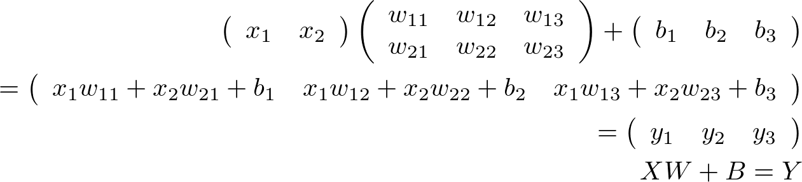
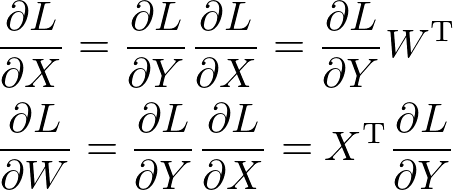

# 順伝播計算

## What's 順伝播
- 入力層から出力層にデータを流していくこと

#### 中間層の定義

- _X_ ・・・入力値
- _W_ ・・・重み
- _B_ ・・・バイアス
- _Y_ ・・・出力値

# 誤差逆伝播

## What's 誤差逆伝播
- 出力層から入力層へ導関数を伝播させること

#### アフィンレイヤの逆伝播の定義

#### 2乗和誤差の逆伝播の定義

- _L_ ・・・損失
