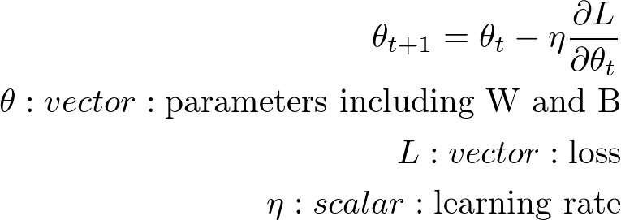

# SGD 学習の最適化 その1

## What's SGD
- ランダムに選択したデータでパラメータを更新していく勾配降下法
- ミニバッチ学習は SGD で解いていることになる

#### SGD の更新式

## Momentum
- 物理法則に準じた動きをする

#### Momentum の更新式

## Nesterov Accelerated Gradient
- Momentum の改良版
- 仮で1つ先の勾配を利用する

#### Nesterov Accelerated Gradient の更新式

#### Nesterov Accelerated Gradient の実装版の更新式

