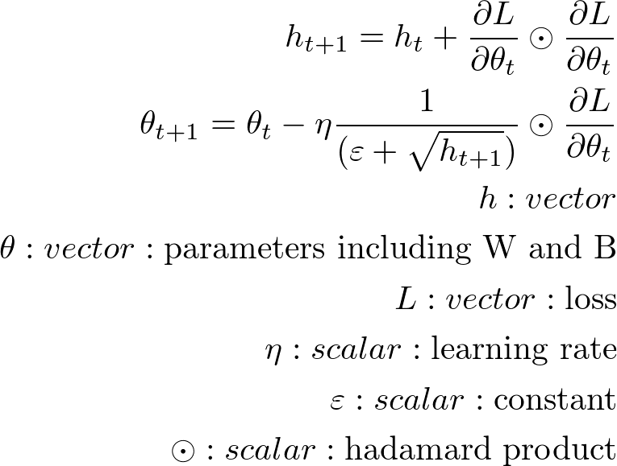
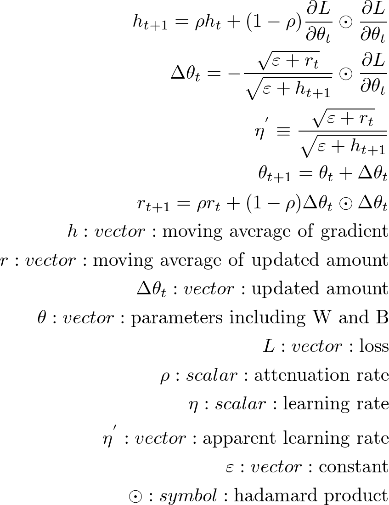

# SGD 学習の最適化 その2

## AdaGrad
- パラメータ毎に学習率を適応させる
- 学習が進むにつれて見かけの学習率が減衰する

#### AdaGrad の更新式

## RMSProp
- AdaGrad の改良版
- 減衰率を足した勾配の2乗移動平均を使用して見かけの学習率を変えていく

#### RMSProp の更新式

## AdaDelta
- AdaGrad の改良版
- 減衰率をそれぞれ足した勾配の2乗移動平均と更新量の2乗移動平均を使用して見かけの学習率を変えていく

#### AdaDelta の更新式

