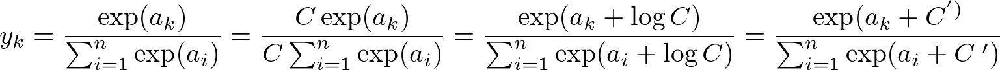

## Softmax 関数まとめ

### What's Softmax 関数
- 活性化関数の一つで他クラス問題で使用されることが多い
- 確率分布を表しており、分母が1になるように正規化されている
- 指数を取ることで確率が負の値になることを防ぎ、確率の高いものと低いものの差を明確にしている
- 指数を取るとオーバーフローを起こすため、実装の際は、特定の値を足すなどする

### Softmax 関数の定義


### オーバーフロー対策
値の最大値を引くことでオーバーフロー対策を施す

#### 実装
```py
import numpy as np

# 2次元配列
x = np.array([1.0, 2.0, 3.0])

# オーバーフロー対策
c = np.max(x)
exp_a = np.exp(x-c)

y = exp_a / np.sum(exp_a)

print(y)
print(y.sum(axis=3))
```

#### 結果
```
[0.09003057 0.24472847 0.66524096]
```

### バッチ対応版
- バッチ
  - 入力値をある程度束ねて処理する
- 入力値の行列の縦方向に対して、オーバーフロー対策の最大値を取り、縦方向の合計を取る
  - (調査中)`Numpy` だと `axis` 属性が次元を表しており、何次元になろうとも `axis=次元-1` を指定する
  - (調査中)なぜ縦方向を使用するのか？

#### 実装
```py
import numpy as np

# 5次元配列
x = np.array([[[[[1.0, 2.0, 3.0],
                 [4.0, 3.0, 2.0]],
                [[1.0, 2.0, 3.0],
                 [4.0, 3.0, 2.0]],
                [[1.0, 2.0, 3.0],
                 [4.0, 3.0, 2.0]],
                [[1.0, 2.0, 3.0],
                 [4.0, 3.0, 2.0]]]]])

# オーバーフロー対策
c = x - np.max(x, axis=x.ndim-1, keepdims=True)
exp_a = np.exp(x-c)

y = np.exp(x) / np.sum(np.exp(x), axis=x.ndim-1, keepdims=True)

print(y)
print(y.sum(axis=x.ndim-1))
```

#### 結果
```
[[[[[0.09003057 0.24472847 0.66524096]
    [0.66524096 0.24472847 0.09003057]]

   [[0.09003057 0.24472847 0.66524096]
    [0.66524096 0.24472847 0.09003057]]

   [[0.09003057 0.24472847 0.66524096]
    [0.66524096 0.24472847 0.09003057]]

   [[0.09003057 0.24472847 0.66524096]
    [0.66524096 0.24472847 0.09003057]]]]]

[[[[1. 1.]
   [1. 1.]
   [1. 1.]
   [1. 1.]]]]
```

#### 参考書籍
- [ゼロから作るDeep Learning――Pythonで学ぶディープラーニングの理論と実装](https://www.oreilly.co.jp/books/9784873117584/)
